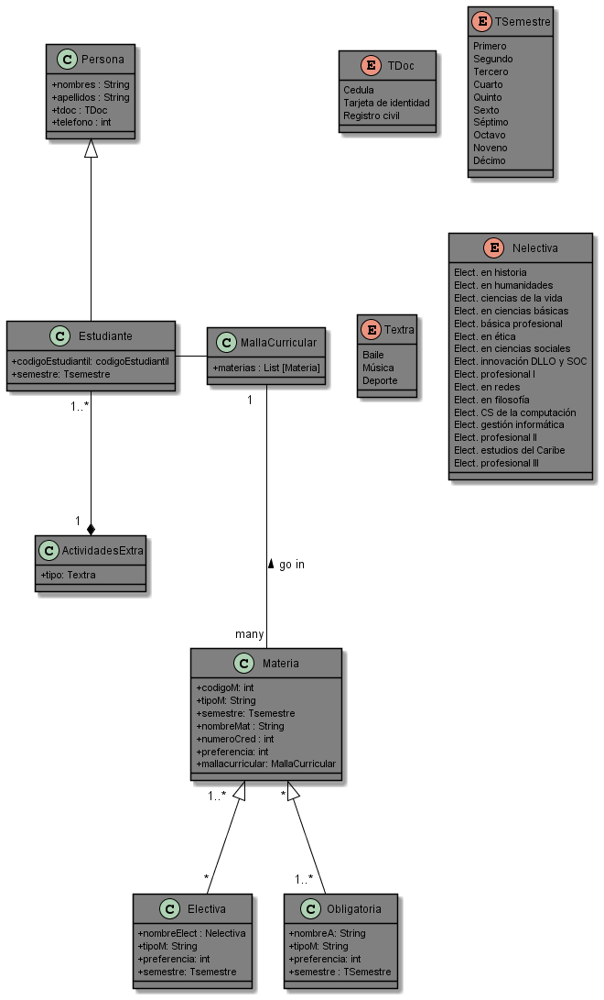

# iPensum
Proyecto programación orientado a objetos 2022-1

## Requerimiento funcional 
- Permite elegir lo que desea buscar (Materia, Semestre específico, etc)
    - Task #1 
        acceder como estudiante o como invitado.
    - Task #2
       validacion de campos vacios cuando se inicia sesión como estudiante.
    - Task #3 
       desplegar las opciones y escoger a su preferencia.
    - Task #4 
       botón de regreso
       
    ## ¿Cómo verificar el funcionamiento de este requerimiento?
     Inicialmente, se debe ingresar a la aplicación y se escoge la manera en la que se desea iniciar, puede iniciar sesión como estudiante o entrar como invitado. Al        inciar sesión como invitado, le permite escoger lo que desea buscar (malla, materia, actividades extra, etc); por otro lado, al iniciar sesion como estudiante          debe loguearse escribiendo su usuario y código estudiantil, cabe desctacar que si no ingresa nada no le permitirá realizar su búsqueda. Despues de ingresar los        datos del  estudiantes, debe hundir "Login" y podrá escoger lo que desea buscar (de igual forma como se realizó al iniciar sesión como invitado). 

# Diagrama UML

