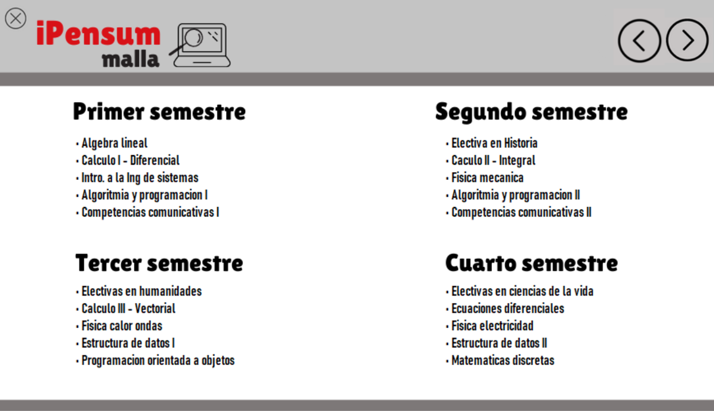

 

### What iPensum allows you to do?
iPensum will give you an unforgettable experience, where you as a user would be able to:
1. Observe what extra activities you could do in the university
2. `Search` the semester you want to observe
3. Obseve the best subjects according to some students in the career
4. `Add` your favorites subjects that `draw` your attention
5. Look the curricular subjects of the career

### Class diagram

## Are you ready?
### Basic functionalities of the app
- Choose the option that you want to look for

 

- Observe the curricular subjects of the career 

 
